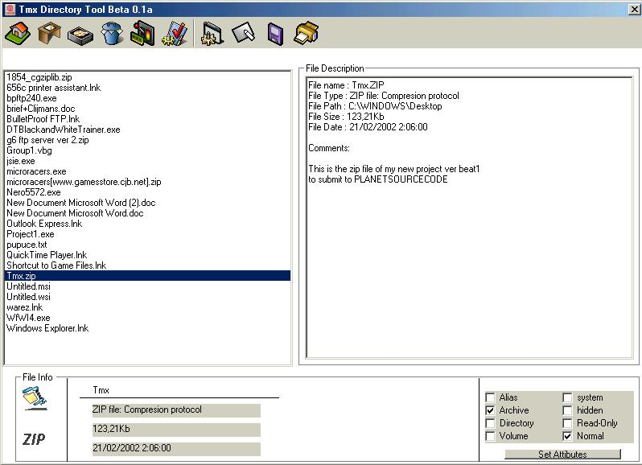



## AA File description tool AA

### Description

Demonstrate the use of several contols such as RitchTextBox, ImageList , ToolBar, PictureBox,PRINTER, PRINTER PREVIEW, file atributes, file info,file size, file date, Icon Extractor, file exists, file extentio, file type, CPU monior,....some EASY API, fully comented for the hadrest parts

I have grabbed some other author's code but I can't find their names back so i you recognize yourself, mail me and 'ill be enjoyed to refer
 
### More Info
 

             |
---                |---
**Submitted On**   |2002-02-21 02:03:58
**By**             |[themaxx](https://github.com/Planet-Source-Code/PSCIndex/blob/master/ByAuthor/themaxx.md)
**Level**          |Beginner
**User Rating**    |5.0 (25 globes from 5 users)
**Compatibility**  |VB 4\.0 \(32\-bit\), VB 5\.0, VB 6\.0
**Category**       |[Files/ File Controls/ Input/ Output](https://github.com/Planet-Source-Code/PSCIndex/blob/master/ByCategory/files-file-controls-input-output__1-3.md)
**World**          |[Visual Basic](https://github.com/Planet-Source-Code/PSCIndex/blob/master/ByWorld/visual-basic.md)
**Archive File**   |[AA\_File\_de565532202002\.zip](https://github.com/Planet-Source-Code/themaxx-aa-file-description-tool-aa__1-31988/archive/master.zip)

